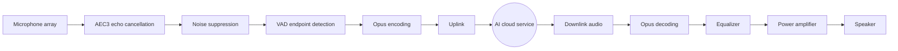
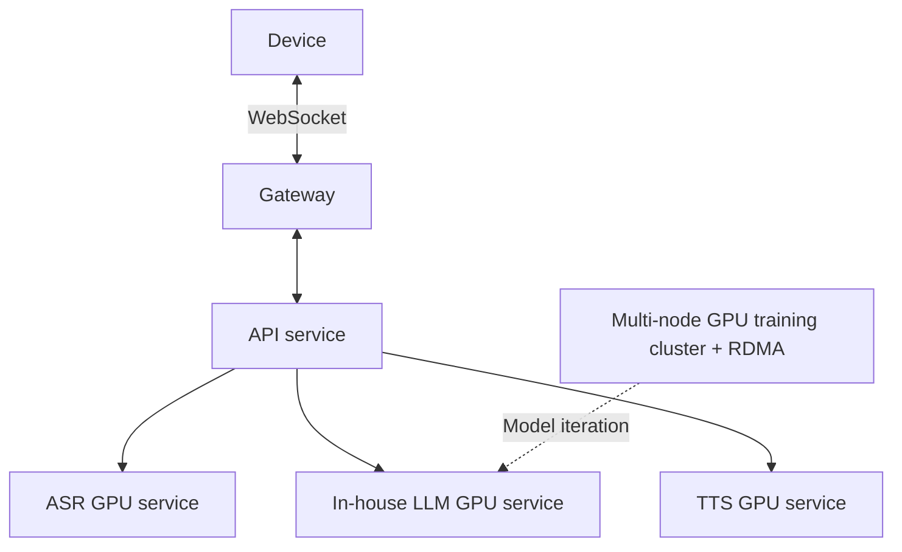

# ZhiYin HBG-V1.0 AI Interactive Toy — Project Overview and Development Plan

> **Classification: Internal material. Access is limited to the project team and authorized institute personnel.**

---

## 1. Product Background and Positioning

ZhiYin HBG-V1.0 is an AI interactive toy for users of all ages. It integrates a multimodal AI conversation engine with voice wake-up, emotion recognition, posture sensing, music requests, and IoT control. Dual Wi-Fi/BLE connectivity links the device to cloud inference services for a natural companion experience.

Unlike simple Bluetooth speakers, this product covers the complete chain: chip selection, hardware circuit design, embedded firmware, in-house AI model training and deployment, cloud compute clusters, mechanical tooling, and final assembly.

---

## 2. Hardware Architecture

### 2.1 Main Controller Plan

| Component | Description |
|------|------|
| Main SoC | High-performance dual-core processor with dual-mode Wi-Fi/BLE radio |
| Co-processor | Independent low-power chip for provisioning, standby management, and wake-up |
| Audio codec | Dedicated audio codec with multi-microphone input and power-amplifier output |
| Display | Color display for expression animation and interaction status |
| Storage | On-board non-volatile storage for firmware, animation assets, and offline models |
| Battery system | Rechargeable lithium battery and charging-management circuit |
| Motion sensor | Multi-axis inertial sensor for detecting taps, shakes, and other gestures |
| Touch sensing | Multi-zone capacitive touch sensing |

> The main controller, co-processor, audio, and sensor devices were selected and match-validated. The detailed bill of materials (BOM) is a core project asset and is not disclosed here.

### 2.2 Hardware Circuit Design

- **Multilayer board:** use a multilayer PCB with strict impedance control and signal-integrity constraints.
- **Key requirements:**
  - Route high-speed audio clock lines with equal length to suppress timing jitter.
  - Tune RF antenna clearance and the pi matching network.
  - Isolate analog and digital ground regions and join them at a single point.
  - Use a grounded board edge to control electromagnetic-interference (EMI) margin.
- **Manufacturing:** high-precision ENIG finish and fully automated SMT placement.

### 2.3 Tooling and Mechanical Structure

- The enclosure and internal frame require custom injection molds.
- Structural parts must provide component retention, an acoustic cavity, and thermal management.
- After the mechanical design is complete, export standard-format files for the mold supplier.

---

## 3. Embedded Firmware Development

### 3.1 Technology Stack

| Layer | Technology |
|------|------|
| RTOS | FreeRTOS with multicore SMP scheduling |
| GUI | LVGL with hardware-DMA-accelerated rendering |
| Audio processing | Audio development framework with a pipeline model |
| Voice codec | Opus + WebRTC AEC3 echo cancellation |
| Wireless management | Wi-Fi (WPA3) + BLE-assisted provisioning |
| Security | TLS encryption + Secure Boot + flash encryption |
| Build | CMake + Ninja incremental builds |

### 3.2 Core Modules

#### 3.2.1 Audio Pipeline

> **Challenge:** echo-cancellation latency must remain extremely low or barge-in quality suffers. The noise-suppression model must run quantized inference on a resource-constrained embedded device, so memory use is tightly constrained.

#### 3.2.2 Emotion Interaction Engine

- The cloud multimodal character-animation foundation model receives conversation semantic vectors and emotion labels, combines them with on-device motion-sensor signals, and generates high-fidelity character expression and motion sequences in real time.
- A lightweight in-house runtime is deployed on the device. Tokenizer-free continuous representations and adaptive quantization enable millisecond-scale decoding and double-buffer rendering for smooth expression and motion transitions.
- Character animation is generated by end-to-end model inference rather than playback of pre-stored assets, allowing continuous cross-emotion generalization and context-aware consistency.

#### 3.2.3 OTA Updates

- Multi-partition switching with rollback fault tolerance.
- Firmware-signature verification to prevent unauthorized images.
- Independent updates for the resource package and firmware.

#### 3.2.4 Low-Power Management

- Deep-sleep mode for ultra-low standby power.
- Multi-level sleep policy: enter light sleep and deep sleep progressively when there is no interaction.
- Multiple wake sources, including touch and timers.

### 3.3 Firmware Topology

The embedded firmware is built around strict low-level module isolation:

- The audio pipeline, GUI, provisioning, protocol layer, OTA, IoT framework, and low-power manager are owned by independent threads and mutex domains.
- High-speed audio decoding and hardware-bus synchronization involve substantial hand-written low-level code.
- With this code scale, even a small logic change can cross highly coupled modules and trigger a cascading memory overflow.

---

## 4. In-House AI Model Training and Deployment

### 4.1 Full LLM Training Pipeline

The complete training chain has four stages, each requiring a dedicated algorithm team and compute budget:

| Stage | Content | Technical focus |
|------|------|---------|
| **1. Data engineering** | Collect, clean, deduplicate, de-identify, and balance trillion-token-scale corpora | Build a data-cleaning pipeline (language identification, quality scoring, MinHash deduplication, privacy filtering) and train a dedicated tokenizer (Tokenizer/BPE) |
| **2. Pre-training** | Train the base model from random initialization | Multidimensional parallelism with `Megatron-LM` + `DeepSpeed ZeRO-3` (tensor TP / pipeline PP / data DP), BF16 mixed precision, and gradient checkpointing |
| **3. Supervised fine-tuning (SFT)** | Fine-tune on high-quality instruction-alignment data so the model understands natural language | Combine full-parameter fine-tuning with efficient `LoRA` fine-tuning and build a dedicated instruction set |
| **4. Reinforcement learning from human feedback (RLHF)** | Train a reward model and use PPO alignment to shape personality and safety boundaries | Reward-model training plus `PPO` / `DPO` preference alignment to prevent harmful output |

### 4.2 Automatic Speech Recognition (ASR)

| Item | Core requirement |
|------|---------|
| Model | In-house acoustic model with lightweight on-device deployment; no generic cloud API |
| Training data | All-age acoustic generalization corpus plus noisy-environment instruction data, cleaned through multiple denoising passes |
| Inference | Multi-node cloud parallelism and a hand-written low-level runtime that supports offline processing on the device |

### 4.3 Emotion Recognition

- Fine-tune a large pre-trained encoder with a nonlinear classification head.
- Use high-dynamic-range generalization data for false-trigger checks.
- Serve as a blocking intermediate layer in the conversation pipeline, tightly coupled to the inference-memory lifecycle.

### 4.4 Text-to-Speech (TTS)

| Item | Core requirement |
|------|---------|
| Protocol | Strictly synchronized streaming audio frames; otherwise the hardware buffer pool can fail |
| Latency limit | First-packet delivery must not block beyond the network-congestion threshold; server bandwidth must remain clean |

### 4.5 Multimodal Character Animation Foundation Model

Character expressions and motion are produced end to end by an in-house multimodal character-animation foundation model, rather than pre-stored assets or a third-party “AI video generation” API. This is a second technical moat after the language model.

| Stage | Content | Technical focus |
|------|------|---------|
| **1. Model definition** | End-to-end expression and motion generation | Input: text semantic vectors, emotion labels, speech-prosody features, and on-device IMU signals; output: continuous high-fidelity expression and motion representations rather than discrete frame stacks |
| **2. Multimodal data engineering** | Synchronously collect and align text, audio, vision, and sensor streams | Data cleaning and quality scoring, temporal misalignment removal, identity consistency, and privacy/copyright compliance filtering |
| **3. Pre-training** | Train the base model on large-scale multimodal corpora | Hybrid Diffusion / Autoregressive / Flow Matching architecture, latent-space compression, tokenizer-free continuous representations, and IMU temporal embeddings in the visual space |
| **4. SFT** | Align high-quality emotion-expression-motion instructions | Combine full-parameter and `LoRA` fine-tuning; add temporal-consistency loss to suppress flicker and abrupt expression changes; lock character identity and art style |
| **5. RLHF alignment** | Reward-model and preference alignment | Evaluate expression naturalness, emotion accuracy, and motion smoothness; use `PPO` / `DPO` preference alignment with safety boundaries to suppress uncanny or inappropriate expressions |
| **6. Cloud-device deployment** | Full cloud model plus a lightweight on-device submodel | Cloud handles complex inference and iteration; the device uses distillation and structured pruning, receives an implicit representation stream, and decodes pixels in real time |

> Direct third-party video-generation APIs have unacceptable latency, style-control, copyright, and edge-collaboration limitations. The project therefore follows the in-house foundation-model route.

---

## 5. Cloud Compute and Services

### 5.1 Model-Training Compute Cluster

Training the in-house models requires **orders of magnitude more compute than inference**, so a dedicated cluster is required:

- **GPU training cluster:** multi-node, multi-GPU high-end cards (A100/H100 class) with InfiniBand/RDMA; otherwise distributed all-reduce becomes the bottleneck.
- **Distributed training:** `Megatron-LM` + `DeepSpeed` with tensor, pipeline, and data parallelism.
- **Data storage and throughput:** high-throughput corpus storage and loading to keep GPUs fed.
- **Scheduling:** `SLURM` / `Kubernetes` orchestration, checkpoint resume, and asynchronous checkpoints.

### 5.2 Online Inference and Service Cluster

After training, production requires an independent, always-on 7×24 inference cluster:

- **GPU inference servers:** real-time in-house LLM inference with sufficient memory for high concurrency.
- **GPU ASR/TTS servers:** isolated streaming speech inference to avoid LLM memory contention.
- **API gateway:** device authentication, session management, and long-lived connections.
- **Database and cache:** persistent storage plus high-concurrency caching.
- **Object storage:** audio and firmware packages.
- **CDN:** accelerated resource distribution.
- **MQTT broker:** device-state reporting and remote-control delivery.

> Both training and inference clusters must be self-hosted or backed by long-term dedicated compute, rather than low-end pay-per-call public-cloud APIs; otherwise the full chain from model iteration to real-time full-duplex conversation cannot be met.

### 5.3 Deployment Topology

---

## 6. Project Development Plan

### 6.1 Team Configuration

| Role | People | Responsibilities |
|------|:---:|------|
| Embedded engineers | 2 | Driver development, audio pipeline, GUI, provisioning, OTA |
| Hardware engineer | 1 | Circuit design, signal integrity, mechanical integration |
| LLM algorithm engineers | 2 | Data engineering, pre-training, SFT, RLHF alignment |
| Speech algorithm engineer | 1 | In-house ASR/TTS model training and edge deployment |
| Backend/platform engineer | 1 | Training-cluster operations, inference services, gateway, database |
| Multimodal art and data engineer | 1 | Animation-data labeling and quality, art-style alignment, interaction design |
| Test engineer | 1 | Functional, audio-quality, and stability testing |
| **Total** | **9** | |

### 6.2 Core Development Flow

1. **Hardware and acoustics:** complete multilayer impedance-controlled PCB design and validate the structure with acoustic simulation to remove cavity standing waves and echo-alignment failures.
2. **Low-level firmware and kernel trimming:** remove redundant RTOS components, rewrite the allocator and audio-bus path, and establish microsecond interrupt response under multicore concurrency.
3. **In-house model training:** build the data-cleaning pipeline and training cluster; complete pre-training → SFT → RLHF and produce a dedicated base model.
4. **Compute deployment and protocol integration:** build a full-duplex streaming engine on the inference cluster, connect device, real-time pipeline, and tool gateway, and enable token-level low-latency speech with cloud-device multimodal animation inference.
5. **Boundary, RF, and tooling validation:** verify antenna clearance in an RF chamber, run pressure/memory-leak aging tests, and deliver a small tooling pilot.

---

## 7. Development Toolchain and Deep Technology Stack

This project is not a superficial wrapper or second-hand integration. It performs source-level reconstruction and in-house development using the following industrial toolchain:

### 7.1 Embedded and Hardware Toolchain

- **Compiler and system:** low-level cross compiler and deeply trimmed RTOS kernel to minimize scheduling overhead.
- **Graphics and DSP:** source-level GUI port bound to hardware DMA; C++ extraction and fixed-point port of the echo-cancellation engine.
- **Hardware development:** professional EDA circuit design and electromagnetic antenna simulation.

### 7.2 In-House Model Training and Inference Framework

- **Pre-training:** `Megatron-LM` + `DeepSpeed ZeRO-3` with TP / PP / DP parallelism.
- **Alignment:** in-house SFT, reward-model, and `PPO` / `DPO` preference-alignment pipeline.
- **Data engineering:** trained tokenizer and large-corpus MinHash deduplication, quality scoring, and privacy filtering.
- **Acoustic models:** in-house ASR/TTS with `LoRA` fine-tuning, post-training quantization (PTQ), and a hand-written edge runtime.
- **Inference acceleration:** low-level `CUDA` and operator optimization with a high-throughput inference engine to handle memory fragmentation under concurrency.

### 7.3 Distributed Network and Server Stack

- **Full-duplex streaming gateway:** asynchronous-I/O custom binary framing engine that removes standard HTTP handshake overhead.
- **Device protocol middleware:** customized parser with out-of-order callback control.
- **Training/inference scheduling:** multi-node `SLURM` / `Kubernetes` orchestration, checkpoint resume, and elastic scaling.
- **High-concurrency data layer:** persistent database plus distributed cache for synchronizing state machines across devices.

### 7.4 On-Device Multimodal Animation Runtime

- **Lightweight inference engine:** direct decoding of tokenizer-free continuous representations, avoiding the overhead of generic embedded frameworks.
- **Operator-level optimization:** hand-written convolution, attention, and upsampling kernels for the target platform.
- **Memory pools:** share external memory between animation-frame and audio buffers, with a custom allocator to prevent long-run fragmentation.
- **Double-buffer DMA rendering:** decode frames while the LCD transfer runs to remove tearing and stutter.
- **Sensor fusion:** inject IMU posture into the model so physical actions can produce responses such as a frown after a tap or a blink after a shake.
