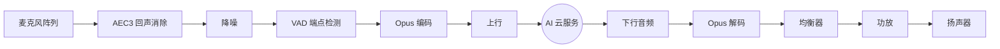
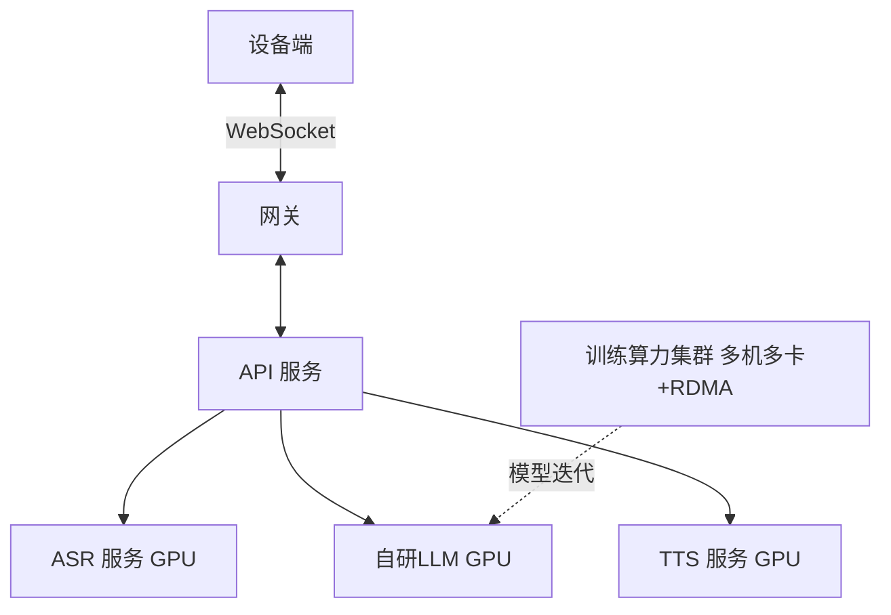

# 智音（ZhiYin）HBG-V1.0 AI 交互玩具 — 项目总览与开发方案

> **密级：内部资料，仅限项目组及院方授权人员查阅**

---

## 一、项目背景与产品定位

智音 HBG-V1.0 是一款面向各个年龄段人群的 AI 交互玩具。产品内置多模态 AI 对话引擎，支持语音唤醒、情感识别、姿态感知、音乐点播、IoT 联动等功能，通过 WiFi/BLE 双模连接云端推理服务，实现自然流畅的陪伴体验。

区别于市面上简单的蓝牙音箱类设备，本产品需要从零完成芯片选型、硬件电路设计、嵌入式固件开发、AI 大模型自研训练与部署、云端算力集群搭建、以及结构模具与整机组装。

---

## 二、硬件架构

### 2.1 主控方案

| 组件 | 说明 |
|------|------|
| 主控 SoC | 高性能双核处理器，集成 WiFi/BLE 双模无线 |
| 协处理器 | 独立低功耗芯片，负责配网、待机管理与唤醒 |
| 音频编解码 | 专用音频 Codec，多路麦克风阵列输入 + 功放输出 |
| 显示 | 彩色显示屏，用于呈现表情动画与交互状态 |
| 存储 | 板载非易失存储，用于固件、动画素材与离线模型 |
| 电池系统 | 可充电锂电池 + 充电管理电路 |
| 姿态传感器 | 多轴惯性传感器，检测拍打、摇晃等手势动作 |
| 触摸感应 | 多区域电容触摸感应 |

> 主控、协处理器、音频、传感器等核心器件均经过专门选型与匹配验证，具体物料清单（BOM）为项目核心资产，不在本文档披露。

### 2.2 硬件电路设计

- **多层板设计**：采用多层 PCB 结构，做严格的阻抗控制与信号完整性约束
- **关键要求**：
  - 音频高速时钟线等长布线，抑制时序抖动
  - 射频天线区域净空与 π 型匹配网络专门调优
  - 模拟地与数字地分区隔离，单点连接
  - 板边包地，控制电磁干扰（EMI）裕量
- **制造**：高精度沉金工艺 + 全自动 SMT 贴片

### 2.3 模具与结构

- 外壳与内部骨架需定制注塑模具
- 结构件需兼顾器件固定、声学腔体设计与散热
- 结构设计完成后导出标准格式文件对接模具厂开模

---

## 三、嵌入式固件开发

### 3.1 技术栈

| 层级 | 技术 |
|------|------|
| RTOS | FreeRTOS（多核 SMP 调度） |
| GUI | LVGL（硬件 DMA 加速渲染） |
| 音频处理 | 音频开发框架（Pipeline 流水线模式） |
| 语音编解码 | Opus + WebRTC AEC3 回声消除 |
| 无线管理 | WiFi（WPA3）+ BLE 辅助配网 |
| 安全 | TLS 加密 + Secure Boot + Flash 加密 |
| 构建 | CMake + Ninja 增量编译 |

### 3.2 核心模块

#### 3.2.1 音频管线

> **难点**：回声消除延迟需控制在极低水平，否则打断体验差；降噪模型需在资源受限的嵌入式端做量化推理，对内存占用要求极为苛刻。

#### 3.2.2 情感交互引擎

- 云端多模态人物动画生成大模型（Foundation Model）接收对话语义向量与情绪标签，联合端侧姿态传感器信号，实时生成高保真人物表情与动作序列
- 端侧部署自研轻量化推理运行时，基于 Tokenizer-free 连续表征与自适应量化策略，毫秒级解码并双缓冲渲染，保证表情与动作流畅切换
- 人物动画并非预存素材播放，而是端到端模型推理输出，具备跨情绪的连续泛化能力与上下文感知的一致性

#### 3.2.3 OTA 升级

- 多分区切换 + 回滚容错机制
- 固件签名校验，防止非法固件刷入
- 资源包与固件独立升级

#### 3.2.4 低功耗管理

- 深度睡眠模式实现超低待机功耗
- 多级休眠策略：无交互时分级进入浅睡眠、深度睡眠
- 触摸 / 定时器多源唤醒

### 3.3 固件核心拓扑拆解

整个嵌入式固件基于强底层的物理剥离机制构建：

- 音频管线、GUI、配网、协议层、OTA 升级、IoT 框架、低功耗管理均由完全独立的线程互斥锁接管
- 高速音频解码与硬件总线同步涉及大量手写底层代码
- 在这等代码规模下，即便进行微小的逻辑变动，极高的跨模块耦合度都会触发断层级的内存溢出。

---

## 四、AI 大模型自研训练与部署

### 4.1 自研大语言模型（LLM）训练全流程

完整训练链路分为四个阶段，每个阶段都需要专门的算法团队与算力投入：

| 阶段 | 内容 | 技术要点 |
|------|------|---------|
| **① 数据工程** | 万亿 Token 级语料采集、清洗、去重、脱敏、配比 | 自建数据清洗流水线（语言识别、质量打分、MinHash 去重、隐私过滤）、自训练专属分词器（Tokenizer / BPE） |
| **② 预训练 (Pre-training)** | 从随机初始化开始训练基座模型 | 基于 `Megatron-LM` + `DeepSpeed ZeRO-3` 的多维并行（张量并行 TP / 流水线并行 PP / 数据并行 DP），混合精度 BF16，梯度检查点 |
| **③ 指令微调 (SFT)** | 用高质量指令对齐数据微调，让模型听懂人话 | 全参数微调 + `LoRA` 高效微调结合，构建专属指令数据集 |
| **④ 人类反馈强化学习 (RLHF)** | 训练奖励模型 + PPO 强化对齐，塑造人格与安全边界 | 奖励模型（Reward Model）训练 + `PPO` / `DPO` 偏好对齐，杜绝有害输出 |

### 4.2 语音识别（ASR）

| 项目 | 核心要求 |
|------|---------|
| 模型 | 自研声学模型 + 端侧轻量化降阶部署，弃用通用云 API |
| 训练数据 | 全年龄段声学泛化语料 + 嘈杂环境指令数据集，多轮降噪清洗 |
| 推理 | 云端多节点并行，端侧手写底层推理运行时支持脱网处理 |

### 4.3 情感识别（Emotion）

- 基于大体量预训练编码器微调，外挂非线性分类头
- 依赖高动态泛化语料做防误触校验
- 作为对话 Pipeline 的阻塞式中间层，与推理显存生命周期深度耦合

### 4.4 语音合成（TTS）

| 项目 | 核心要求 |
|------|---------|
| 协议 | 强同步流式返回音频帧，否则硬件缓冲池直接崩溃 |
| 延迟极限 | 首包传输阻塞不得超过网络拥塞阈值，对服务器带宽纯净度要求苛刻 |

### 4.5 多模态人物动画生成大模型（Multimodal Character Animation Foundation Model）

产品的人物表情与动作并非预存素材，也非调用第三方“AI 生成视频”接口，而是由项目组自研的多模态人物动画生成 Foundation Model 端到端训练产出。这是继语言模型之后，另一道深的技术护城河。

| 阶段 | 内容 | 技术要点 |
|------|------|---------|
| **① 模型定位** | 端到端人物表情与动作生成 Foundation Model | 输入：文本语义向量、情绪标签、语音韵律特征、端侧 IMU 姿态信号；输出：高保真表情与动作序列的连续隐式表征，而非离散帧堆叠 |
| **② 多模态数据工程** | 文本-语音-视觉-传感器四路同步采集与对齐 | 自研数据清洗与质量打分流水线、时序错位剔除、人物身份一致性约束、隐私与版权合规过滤 |
| **③ 预训练** | 在大规模多模态语料上训练基座 | 采用 Diffusion / Autoregressive / Flow Matching 混合架构；隐空间（Latent Space）压缩；探索 Tokenizer-free 连续表征；IMU 时序编码为与视觉同空间的嵌入 |
| **④ 监督微调 (SFT)** | 高质量“情绪-表情-动作”指令对齐 | 全参数微调 + `LoRA` 高效微调结合；引入时序一致性损失，抑制帧间闪烁与表情跳变；锁定角色人格与美术风格 |
| **⑤ RLHF 对齐** | 奖励模型 + 偏好对齐 | 训练人类偏好奖励模型，评估“表情自然度”“情绪准确度”“动作流畅度”；`PPO` / `DPO` 对齐人类审美；设置安全边界，抑制恐怖谷与不当表情 |
| **⑥ 端云协同部署** | 云端完整模型 + 端侧轻量化子模型 | 云端承担高复杂度推理与模型迭代；端侧经知识蒸馏与结构化剪枝后部署轻量化子模型；云端下发隐式表征流，端侧实时解码为像素帧 |

> 直接调用第三方视频生成 API 存在延迟高、风格不可控、版权风险大、无法端侧协同等致命缺陷，必须走自研 Foundation Model 路线。

---

## 五、云端算力与服务

### 5.1 模型训练算力集群

自研大模型的训练对算力的要求是**数量级高于推理**的，必须具备专门的训练集群：

- **GPU 训练集群**：多机多卡规模的高端训练卡（A100 / H100 级别），节点间需 InfiniBand / RDMA 高速互联，否则分布式 all-reduce 通信会成为瓶颈
- **分布式训练框架**：`Megatron-LM` + `DeepSpeed`，结合张量并行、流水线并行、数据并行的多维切分
- **数据存储与吞吐**：海量语料的高速存储与数据加载流水线，避免 GPU 因等数据而空转
- **训练调度**：基于 `SLURM` / `Kubernetes` 的多节点任务编排、断点续训、异步 checkpoint

### 5.2 在线推理与服务集群

训练完成后，线上还需一套独立的、7×24 常驻的推理服务集群：

- **GPU 推理服务器**：承载自研 LLM 的实时推理，显存充足、支持多路高并发
- **GPU 推理服务器（ASR / TTS）**：独立承载语音识别与合成的流式推理，与 LLM 物理隔离避免显存争抢
- **API 网关服务器**：异步任务调度，负责设备鉴权、会话管理、长连接维持
- **数据库**：持久化数据库 + 高并发缓存
- **对象存储**：存放音频文件与固件包
- **CDN**：加速固件与资源包分发
- **MQTT Broker**：设备状态上报与远程控制指令下发

> 训练集群与推理集群均需自建或长期租赁专门算力节点，而非按次计费的低配公有云 API，否则无法满足从模型迭代到实时全双工对话的全链路要求。

### 5.3 部署拓扑

---

## 六、项目开发计划

### 6.1 团队配置

| 角色 | 人数 | 职责 |
|------|:---:|------|
| 嵌入式工程师 | 2 | 驱动开发、音频管线、GUI、配网、OTA |
| 硬件工程师 | 1 | 电路设计、信号完整性、EMC、结构对接 |
| 大模型算法工程师 | 2 | 数据工程、预训练、SFT、RLHF 对齐 |
| 语音算法工程师 | 1 | ASR / TTS 自研模型训练与端侧部署 |
| 后端 / 平台工程师 | 1 | 训练集群运维、推理服务、网关、数据库 |
| 多模态美术与数据工程师 | 1 | 人物动画训练数据标注与质量把控、美术风格对齐、交互界面设计 |
| 测试工程师 | 1 | 功能测试、音频质量测试、稳定性测试 |
| **合计** | **9** | |

### 6.2 核心开发流程

1. **硬件与声学建构**：完成多层阻抗控制 PCB 设计；基于声学仿真做结构验证，消除腔体驻波与回声对齐失败问题。
2. **底层固件与内核裁剪**：在 RTOS 基础上剥离冗余组件，重写内存分配器与音频总线驱动链路，建立多核并发的微秒级中断响应机制。
3. **大模型自研训练**：搭建数据清洗流水线与训练集群，完成预训练 → SFT → RLHF 全链路，产出专属基座模型。
4. **算力部署与协议融合**：在推理集群上搭建全双工流式引擎，打通设备端、实时管道、工具调用网关的数据链路，实现 Token 级低延迟吐字与多模态人物动画生成大模型的端云协同推理。
5. **边界对抗与模具开模**：射频暗室验证天线净空；执行全套压力与内存泄漏老化测试；交付结构模具图纸小批量打样熟化。

---

## 七、开发工具链与硬核技术栈

本项目拒绝使用简单的套壳二次开发方式，完全深入到底层源代码级别的重构与自研，依赖以下复杂的工业级工具链：

### 7.1 嵌入式与硬件工具栈

- **编译器与系统**：底层交叉编译工具链，RTOS 内核深度裁剪以极小化调度开销
- **图形与数字信号处理**：GUI 框架源码级移植绑定硬件 DMA；回声消除引擎 C++ 源码抽取与定点化运算
- **硬件开发**：专业电路设计 EDA + 天线结构电磁仿真工具

### 7.2 自研大模型训练与推理框架

- **预训练框架**：`Megatron-LM` + `DeepSpeed ZeRO-3`，多维并行（TP / PP / DP）训练自研基座模型
- **对齐框架**：自建 SFT 指令微调 + 奖励模型 + `PPO` / `DPO` 偏好对齐流水线
- **数据工程**：自训练分词器（Tokenizer）、海量语料清洗去重流水线（MinHash / 质量打分 / 隐私过滤）
- **声学模型**：自研 ASR / TTS 模型，结合 `LoRA` 微调与训练后量化（PTQ），端侧手写推理运行时
- **推理加速**：底层 `CUDA` / 算子级优化 + 高吞吐推理引擎，应对高并发下的显存碎片化

### 7.3 分布式网络与服务端栈

- **全双工流式网关**：异步 I/O 构建的自定义二进制拆包引擎，剥离标准 HTTP 握手耗时
- **设备协议中台**：定制化协议解析器，支持乱序回调控制
- **训练 / 推理调度**：`SLURM` / `Kubernetes` 多节点编排、断点续训、弹性扩缩容
- **高并发数据层**：持久化数据库结合分布式缓存集群，承载多设备并行的状态机同步

### 7.4 端侧多模态动画推理运行时

- **自研轻量化推理引擎**：支持 Tokenizer-free 连续表征的直接解码，替代通用推理框架在嵌入式平台上的高开销
- **算子级优化**：针对目标平台手写核心算子（卷积、注意力、上采样），避免通用算子的冗余内存访问
- **内存池化管理**：动画帧缓存与音频缓冲区共享外部扩展内存，定制分配策略防止长时间运行后的碎片化
- **双缓冲 DMA 渲染**：解码帧与 LCD 传输并行，消除画面撕裂与卡顿
- **传感器融合**：IMU 姿态信号实时注入模型，实现“被拍打时皱眉”“摇晃时眨眼”等物理响应

