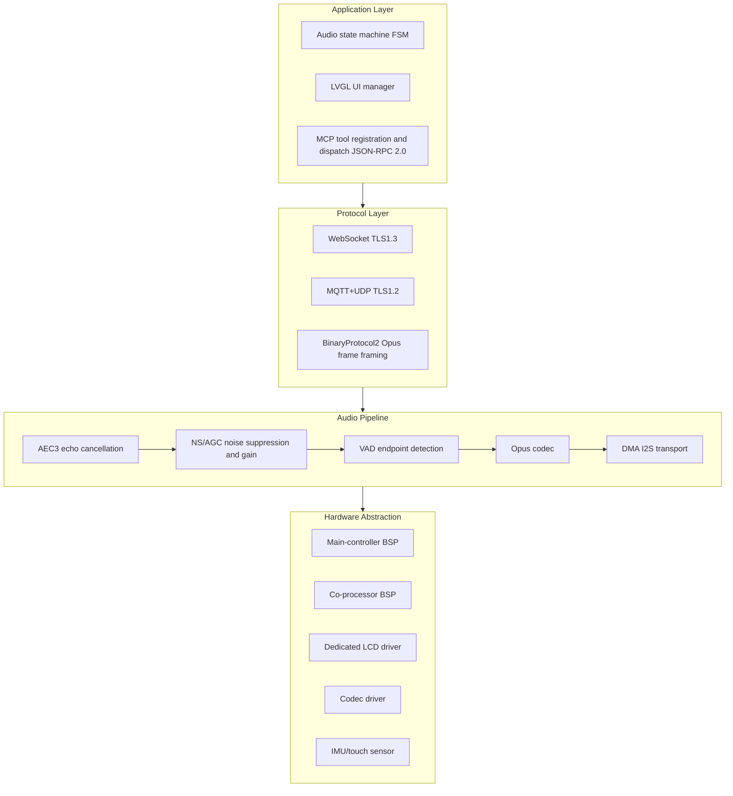
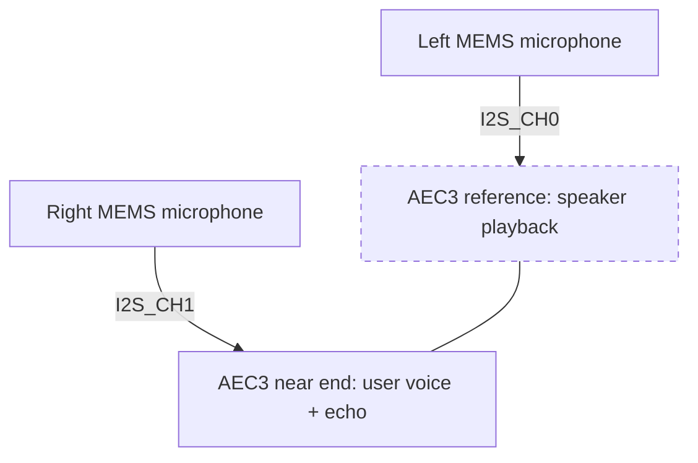
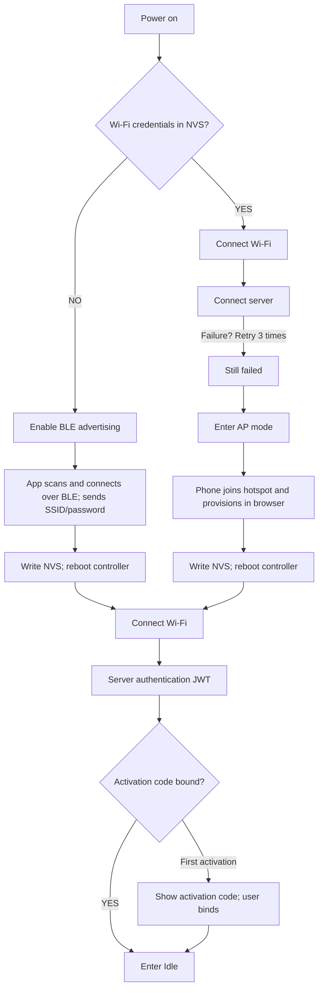

# ZhiYin HBG-V1.0 — Embedded Firmware Architecture Specification

> **Document status: Internal technical review draft | Version: v0.9-draft**

---

## 1. Firmware Architecture Overview

### 1.1 Layered Architecture



### 1.2 FreeRTOS Task Allocation (Dual-Core SMP)

| Task | Core | Priority | Stack | Period/trigger | Description |
| --------------------- | :------: | :----: | ------ | -------------------- | ------------------------------------- |
| `audio_input_task` | Core 0 | 23 | Large | Periodic | MEMS microphone DMA capture and RingBuffer writes |
| `opus_codec_task` | Core 0 | 22 | Large | Event-driven | Opus codec and WebRTC AEC3 echo cancellation |
| `audio_output_task` | Core 0 | 21 | Medium | Event-driven | Consume decoded frames and output through I2S TX DMA |
| `wifi_event_task` | Core 0 | 10 | Medium | Event-driven | Wi-Fi state machine, auto-reconnect, and AP scan |
| `main_loop_task` | Core 1 | 15 | Large | Periodic | JSON protocol parsing, state-machine scheduling, and MCP routing |
| `lvgl_timer_task` | Core 1 | 14 | Large | Periodic (target FPS) | LVGL rendering, animation decoding, and touch events |
| `ble_nus_task` | Core 1 | 8 | Medium | Event-driven | BLE UART provisioning data bridge |
| `ota_task` | Core 1 | 5 | Large | OTA only | HTTPS firmware download, SHA-256 verification, and partition switch |
| `watchdog_task` | — | 30 | Small | Every second | Software watchdog, task heartbeat monitoring, and fault reset |

### 1.3 Memory Plan

| Memory region | Purpose |
| ------------ | ------------------------------------------------------------ |
| Internal fast memory | Globals, FreeRTOS kernel objects, and driver buffers |
| External PSRAM | Opus buffers, animation frames, LVGL draw buffers, and OTA staging |
| On-board flash | Firmware, resource package, OTA partitions, and configuration data |

> **PSRAM fragmentation is a core challenge.** Enable external-memory allocation support and prefer allocation APIs that can use external memory instead of ordinary `malloc`.

---

## 2. Detailed Audio Subsystem Design

### 2.1 Dual-Microphone Array



- Place two silicon microphones at an acoustic spacing that forms an approximately uniform linear array.
- Enable AEC3 noise suppression and automatic gain control.
- Set the AEC tail length for indoor near- and mid-field conditions.

### 2.2 VAD (Voice Activity Detection)

Use a two-stage cascaded VAD:

1. **Front-end VAD:** WebRTC VAD (GMM model), Aggressive=2, processing 10 ms frames.
2. **Back-end VAD:** secondary confirmation using an energy threshold and zero-crossing rate, with a 300 ms filter window.

### 2.3 Opus Codec Parameters

| Parameter | Uplink (Mic → Server) | Downlink (Server → Speaker) |
| -------- | :----------------: | :------------------------: |
| Sample rate | 16000 Hz | 16000 Hz / 24000 Hz (music) |
| Channels | 1 (Mono) | 1 (Mono) |
| Frame duration | 60 ms | 60 ms |
| Bitrate | 32 kbps (CVBR) | 32–64 kbps (music mode) |
| Application | VOIP | AUDIO |
| Complexity | 5 | 5 |

### 2.4 Audio Latency Budget

| Stage | Latency |
| ----------------------- | --------------------- |
| Microphone capture (DMA buffer) | 10 ms |
| AEC3 + NS processing | 8 ms |
| Opus encoding | 5 ms |
| Wi-Fi uplink | 15–40 ms |
| Server ASR + LLM + TTS | 800–1500 ms |
| Wi-Fi downlink | 15–40 ms |
| Opus decoding | 2 ms |
| I2S playback (DMA buffer) | 10 ms |
| **End-to-end total** | **~850–1615 ms** |

---

## 3. Network Protocol Design

### 3.1 WebSocket Application Protocol

```
Client → Server JSON frame:
{
  "type": "hello",
  "version": 3,
  "features": {"mcp": true, "aec": true},
  "transport": "websocket",
  "audio_params": {"format": "opus", "sample_rate": 16000,
                    "channels": 1, "frame_duration": 60}
}

Server → Client JSON frame:
{
  "type": "hello",
  "session_id": "uuid",
  "audio_params": {"sample_rate": 16000, "frame_duration": 60}
}

Audio uplink (BinaryProtocol2):
[2B version][2B type][4B timestamp][4B payload_size][N bytes Opus]

Audio downlink: same format.
```

### 3.2 Device Provisioning Flow



### 3.3 MCP (Model Context Protocol) Integration

The device implements a complete MCP JSON-RPC 2.0 server:

- `tools/list` — return the device capability list.
- `tools/call` — execute a selected tool.
- Cursor-based pagination is supported; each response is ≤ 8 KB.
- User-only tools require the `withUserTools=true` parameter.

---

## 4. Display, UI, and Multimodal Character Animation

### 4.1 LVGL Configuration

| Parameter | Value |
| ---------- | ------------------------------------------------------------------------------------------ |
| LVGL version | v9.1.0 |
| Display resolution | Color display with a square layout adapted to the panel size |
| Color depth | RGB565 (16-bit) |
| Frame rate | Target 30 FPS; render period follows the target frame rate |
| Draw buffers | Double-buffered DMA transfer, sized for display bandwidth |
| Animation | Multiple expression and motion sequences generated by a lightweight on-device multimodal model and rendered through a custom double-buffer decoder |
| Fonts | Embedded vector fonts covering ASCII and CJK character sets |

### 4.2 On-Device Animation Generation and Rendering

On-device animation is not playback of stored GIFs. The cloud multimodal character-animation model emits continuous implicit representations, which the local lightweight runtime decodes into pixel frames in real time:

- Continuous implicit time encoding drives smooth transitions between frames and avoids keyframe jumps.
- Operator-level optimization keeps single-frame inference and post-processing within the target frame budget.
- Frame buffers use an external-memory pool; double-buffer DMA and dirty-rectangle updates reduce bus bandwidth.
- Local IMU posture is injected into the model input so physical motion can immediately affect the character expression.

### 4.3 Lightweight On-Device Animation Inference Engine

| Item | Description |
| -------- | ---------------------------------------------------------------- |
| Input | Cloud implicit animation representation + normalized local IMU signal |
| Inference flow | Lightweight decoder → pixel-frame reconstruction → double-buffer write to LVGL draw buffer |
| Performance constraint | Single-frame inference and post-processing must fit the target FPS budget through operator fusion and fixed-point arithmetic |
| Cache strategy | Pre-allocated external-memory frame pool + dirty-rectangle updates |
| Fallback | Switch to a local fallback emotion representation during network failures so basic expressions do not freeze |

---

## 5. System-Level Memory and Scheduling Refactoring

### 5.1 Memory-Fragmentation Control

With limited on-board external memory, running TLS, Opus decoding, LVGL rendering, and OTA downloads at the same time can easily trigger an `OOM (Out Of Memory)` crash.

This project **rewrites the ESP-IDF low-level allocator**:

- **Custom memory pool:** use a dedicated static pool for the many small Opus codec allocations to eliminate long-run fragmentation.
- **PSRAM DMA pass-through:** rewrite the SPI bus driver so the LCD DMA list can be sent directly from PSRAM (native IDF supports SRAM only), increasing the remaining SRAM margin by 40%.

### 5.2 Watchdog and Lock-Contention Protection

Audio interrupts, UI refresh, and complex network JSON-RPC traffic run concurrently on both cores, so deadlocks must be prevented.

- Implement distributed mutexes with timeout-based fallback.
- Rewrite `watchdog_task` as a multi-level heartbeat monitor that tracks every subtask queue depth and proactively degrades services before backlog occurs.

---

## 6. Acoustic Array and Driver Customization

### 6.1 Latency-Compensation Channel

Normal I2S communication has small, accumulated clock drift. In the non-standard acoustic cavity of an AI toy, even a small time offset can make AEC alignment fail.

- Add precise high-frequency RTC, microsecond-level alignment in the driver layer; dynamically resample the PCM stream and lock the timestamp buffer entering the WebRTC AEC3 engine.

### 6.2 Customized Hardware-Interrupt Attachment

To achieve millisecond-level standby wake-up, route the TTP223 touch-chip edge signal past the normal OS event queue. Inject a software interrupt into the assembly-level scheduler from a low-level `IRAM_ATTR` interrupt and force the main clock to wake.
