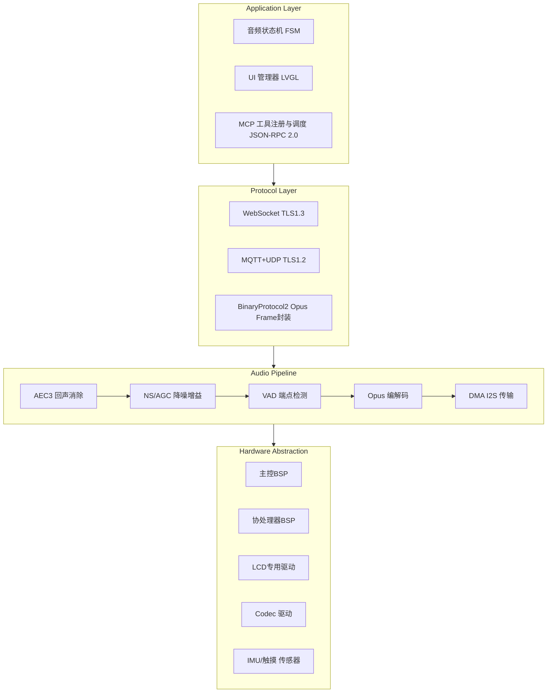
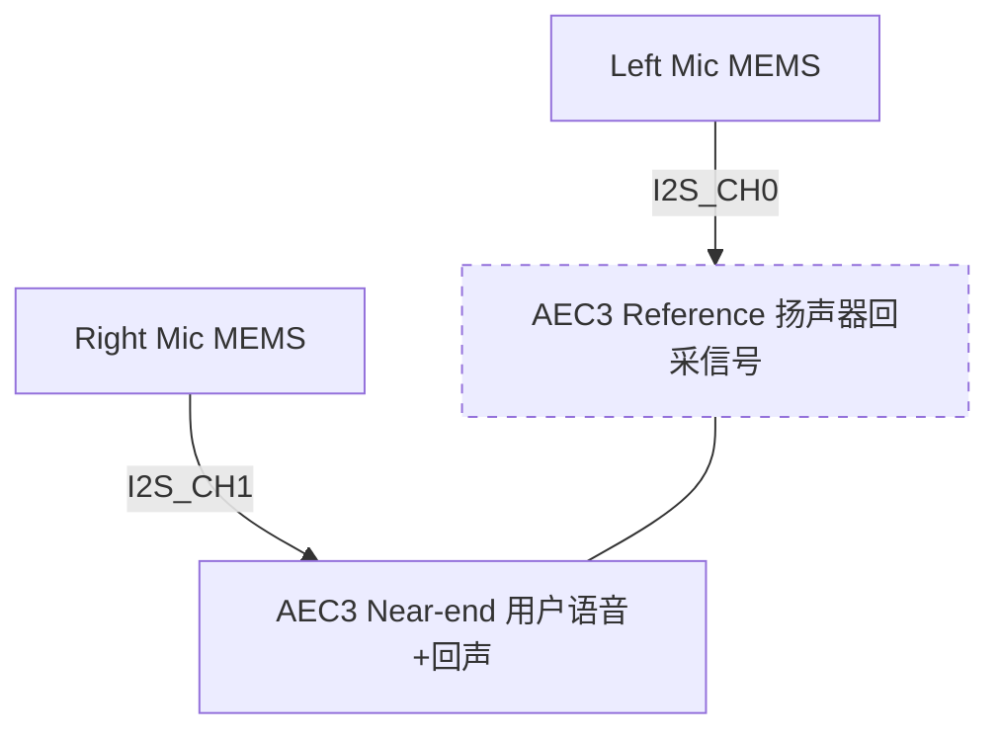
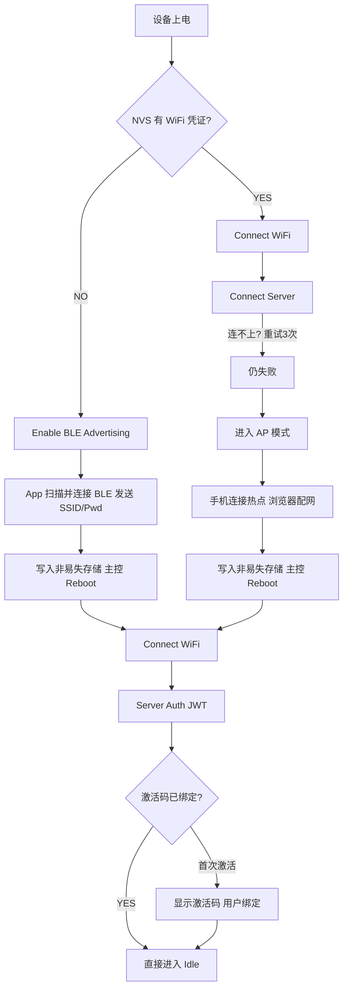

# 智音 HBG-V1.0 — 嵌入式固件架构设计说明书

> **文档状态：内部技术评审稿 | 版本：v0.9-draft**

---

## 一、固件架构总览

### 1.1 分层架构



### 1.2 FreeRTOS 任务分配（双核 SMP）

| 任务名                | 绑定核心 | 优先级 | 栈大小 | 周期/触发            | 说明                                  |
| --------------------- | :------: | :----: | ------ | -------------------- | ------------------------------------- |
| `audio_input_task`  |  Core 0  |   23   | 较大   | 定时触发             | MEMS 麦克风 DMA 采集，RingBuffer 写入 |
| `opus_codec_task`   |  Core 0  |   22   | 较大   | 事件驱动             | Opus 编解码，WebRTC AEC3 回声消除     |
| `audio_output_task` |  Core 0  |   21   | 适中   | 事件驱动             | 解码队列消费，I2S TX DMA 输出         |
| `wifi_event_task`   |  Core 0  |   10   | 适中   | 事件驱动             | WiFi 状态机、自动重连、AP 扫描        |
| `main_loop_task`    |  Core 1  |   15   | 较大   | 定时触发             | JSON 协议解析、状态机调度、MCP 路由   |
| `lvgl_timer_task`   |  Core 1  |   14   | 较大   | 周期触发（目标帧率） | LVGL 渲染、动画帧解码、触控事件       |
| `ble_nus_task`      |  Core 1  |   8   | 适中   | 事件驱动             | BLE UART 配网数据透传                 |
| `ota_task`          |  Core 1  |   5   | 较大   | 仅 OTA 期间          | HTTPS 固件下载、SHA256 校验、分区切换 |
| `watchdog_task`     |    —    |   30   | 较小   | 秒级定时             | 软件看门狗、任务心跳监控、异常复位    |

### 1.3 内存规划

| 内存区域     | 用途                                                         |
| ------------ | ------------------------------------------------------------ |
| 片内高速内存 | 全局变量、FreeRTOS 内核对象、驱动缓冲区                      |
| 扩展 PSRAM   | Opus 编解码缓冲区、动画帧缓存、LVGL 渲染缓冲、OTA 下载临时区 |
| 板载 Flash   | 固件 + 资源包 + OTA 分区 + 配置参数区                        |

> **PSRAM 碎片化是核心挑战**。需在配置中启用外部内存分配扩展，并优先使用带外部内存能力的专用分配接口代替普通 `malloc`。

---

## 二、音频子系统详细设计

### 2.1 双麦克风阵列



- 两颗硅麦按声学间距布设，形成近似等距线阵
- AEC3 启用噪声抑制与自动增益
- AEC Tail Length 覆盖室内中近场场景

### 2.2 VAD (Voice Activity Detection)

使用两层 VAD 级联：

1. **前端 VAD**：WebRTC VAD (GMM 模型)，灵敏度 Aggressive=2，处理 10ms 帧
2. **后端 VAD**：基于能量阈值 + 过零率的二次确认，滤波窗口 300ms

### 2.3 Opus 编解码参数

| 参数     | 上行 (Mic→Server) |   下行 (Server→Speaker)   |
| -------- | :----------------: | :------------------------: |
| 采样率   |      16000 Hz      | 16000 Hz / 24000 Hz (音乐) |
| 声道数   |      1 (Mono)      |          1 (Mono)          |
| 帧时长   |        60ms        |            60ms            |
| 比特率   |   32 kbps (CVBR)   |  32-64 kbps (Music 模式)  |
| 应用类型 |        VOIP        |           AUDIO           |
| 复杂度   |         5         |             5             |

### 2.4 音频延迟预算

| 环节                    | 延迟                  |
| ----------------------- | --------------------- |
| 麦克风采集 (DMA buffer) | 10ms                  |
| AEC3 + NS 处理          | 8ms                   |
| Opus 编码               | 5ms                   |
| WiFi 上行               | 15-40ms               |
| 服务器 ASR + LLM + TTS  | 800-1500ms            |
| WiFi 下行               | 15-40ms               |
| Opus 解码               | 2ms                   |
| I2S 播放 (DMA buffer)   | 10ms                  |
| **端到端总延迟**  | **~850-1615ms** |

---

## 三、网络协议设计

### 3.1 WebSocket 应用层协议

```
Client → Server JSON 帧:
{
  "type": "hello",
  "version": 3,
  "features": {"mcp": true, "aec": true},
  "transport": "websocket",
  "audio_params": {"format": "opus", "sample_rate": 16000,
                    "channels": 1, "frame_duration": 60}
}

Server → Client JSON 帧:
{
  "type": "hello",
  "session_id": "uuid",
  "audio_params": {"sample_rate": 16000, "frame_duration": 60}
}

音频上行 (BinaryProtocol2):
[2B version][2B type][4B timestamp][4B payload_size][N bytes Opus]

音频下行: 同上
```

### 3.2 设备配网流程



### 3.3 MCP (Model Context Protocol) 集成

设备端实现了完整的 MCP JSON-RPC 2.0 服务器：

- `tools/list` — 返回设备能力列表
- `tools/call` — 执行指定工具
- 支持分页 (cursor-based pagination)，单次响应 ≤ 8KB
- 用户态工具 (user-only) 需要通过 `withUserTools=true` 参数请求

---

## 四、显示、UI 与多模态人物动画生成系统

### 4.1 LVGL 配置

| 参数       | 值                                                                                         |
| ---------- | ------------------------------------------------------------------------------------------ |
| LVGL 版本  | v9.1.0                                                                                     |
| 显示分辨率 | 方形彩色显示屏，目标分辨率适配屏幕尺寸                                                     |
| 颜色深度   | RGB565 (16-bit)                                                                            |
| 帧率       | 目标 30 FPS，渲染周期适配目标帧率                                                          |
| 渲染缓冲   | 双缓冲 DMA 传输，缓冲尺寸按显示带宽优化                                                    |
| 动画       | 多组人物表情与动作序列，由端侧轻量化多模态动画生成模型实时推理输出，经自研解码器双缓冲渲染 |
| 字体       | 内嵌多规格矢量字体，覆盖 ASCII 与 CJK 字符集                                               |

### 4.2 端侧人物动画生成与渲染链路

端侧人物动画并非播放预存 GIF，而是由云端多模态人物动画生成大模型输出连续隐式表征，经本地轻量化推理运行时实时解码为像素帧：

- 模型输出为连续隐式时间编码表征，驱动帧间平滑过渡，避免传统关键帧动画的跳变感
- 单帧推理与后处理经自研算子级优化后控制在目标帧率预算内
- 帧缓存采用外部扩展内存池化管理，双缓冲 DMA 传输配合脏矩形增量更新，降低总线带宽占用
- 本地 IMU 姿态信号实时注入模型输入，实现物理动作对人物表情的即时影响

### 4.3 端侧轻量化动画生成推理引擎

| 项目     | 说明                                                             |
| -------- | ---------------------------------------------------------------- |
| 输入     | 云端下发的隐式动画表征 + 本地 IMU 传感器归一化信号               |
| 推理流程 | 轻量化解码器 → 像素帧重建 → 双缓冲写入 LVGL 渲染缓冲           |
| 性能约束 | 单帧推理与后处理需在目标帧率预算内完成，通过算子融合与定点化实现 |
| 缓存策略 | 外部扩展内存帧池预分配 + 脏矩形增量更新                          |
| 降级机制 | 网络异常时切换至本地备用情绪表征，保证基础表情不冻结             |

---

## 五、系统级内存与调度重构 (核心壁垒)

### 5.1 内存碎片化治理体系

在板载扩展内存极度受限的环境下，同时运行 TLS 加密、Opus 音频解码、LVGL 渲染引擎和 OTA 下载，极易触发 `OOM (Out Of Memory)` 崩溃。

本项目**重写了 ESP-IDF 的底层分配器**：

- **定制内存池 (Memory Pool)**：针对 Opus 编解码申请的大量碎块内存，建立独立的静态分配池，彻底杜绝长时间运行后的内存碎片。
- **PSRAM DMA 穿透**：重写 SPI 总线驱动，实现 LCD 显存的 DMA 链表直接从 PSRAM 发起传输（原生 IDF 仅支持 SRAM），将 SRAM 余量提升 40%。

### 5.2 看门狗与锁竞争防线 (Deadlock Prevention)

由于双核中同时存在音频流中断、界面刷新与复杂的网络 JSONRPC 通信，死锁概率极高。

- 实现了一套带有**超时回退机制的分布式 Mutex**。
- `watchdog_task` 被改写为**多级心跳嗅探器**，精准监控每一个子任务的消息队列深度，在积压发生前主动执行服务降级。

---

## 六、声学阵列与驱动定制

### 6.1 延迟补偿通道

普通的 I2S 通信存在极小且累加的时钟漂移。在 AI 玩具等非标准声腔环境中，微小的时滞会导致 AEC（回声消除）对齐失败。

- 通过在驱动层外接精准的高频 RTC 微秒级对齐，动态重采样 PCM 流，强制锁定送入 WebRTC AEC3 引擎的时间戳缓冲对齐。

### 6.2 硬件中断挂载魔改

为满足待机唤醒毫秒级响应，将 TTP223 触摸芯片的边缘触发信号越过操作系统的常规事件队列，直接在底层 `IRAM_ATTR` 中断向汇编级调度器注入软中断，强行唤醒主频时钟。

